<h1 align="center">timecapsule</h1>
<p align="center">
  
  <br>
  <em>A git-like filesystem that automatically creates narrative commits.</em>
  <br>
  <br>
  <a href="#quick-start">Quick Start</a> ·
  <a href="#how-it-works">How It Works</a> ·
  <a href="#browsing">Browsing</a> ·
  <a href="#ollama">LLM Narrator</a>
  <br>
  
  
  
</p>

---

Every file has a story. timecapsule is a background daemon that watches your project folders and creates narrative commit messages from your changes — automatically.

After 2 minutes of inactivity on a file, it snapshots the changes to a local Git repository. The commit message is generated by a small local LLM that summarizes *why* you made the changes, not just what changed.

> *"Renamed parse() to tokenize() after the linter complained about naming — also dropped the unused xml import."*

Over time, you get a searchable, browsable timeline of your work. Each file's history becomes a diary.

## Quick Start

```bash
pip install capsule-narrative
timecapsule
```

This watches the current directory tree. After 2 minutes of inactivity on a file, it snapshots the changes.

```bash
timecapsule /path/to/project          # Watch a specific directory
timecapsule --idle 60                 # Faster snapshots (60s idle)
timecapsule --once                    # One-time snapshot of all files
timecapsule --browse                  # Open the timeline browser TUI
timecapsule --status                  # Show capsule stats
```

## How It Works

**File watcher.** A background daemon monitors file changes using `watchdog`. When a file hasn't been modified for 2 minutes (configurable), it triggers a snapshot — you've finished a thought.

**Git backend.** Each file gets its own orphan branch in a dedicated bare repository at `~/.capsule/timecapsule`. The user's real Git repos are never touched. Branches are named by canonical path, so renaming or moving a file can continue its history.

**Narrative commit messages.** The daemon diffs the current file against its last snapshot and generates a commit message that reads like a diary entry.

## Browsing

```bash
timecapsule --browse
```

Opens a Textual TUI that shows:
- **Tracked files** — all files with snapshots, sorted by most recent
- **Timeline** — commit history for the selected file with narrative messages
- **Diff preview** — file content at any selected snapshot

You can scroll through history, search messages, and see exactly what your file looked like at any point.

## Ollama

timecapsule works without Ollama — it generates structural commit messages by default ("Added 3 lines to main.py (Python)"). But with Ollama installed, the messages transform into genuine narrative.

```bash
ollama pull qwen2.5-coder:1.5b
```

This ~1GB model runs on any modern laptop and generates commit messages in ~2 seconds. Smaller models like `llama3.2:1b` also work.

The prompt context includes the file diff, the file path, and the previous commit message for continuity. The LLM explains *why* the changes were made, not just *what* changed.

## Architecture

```
~/.capsule/
├── timecapsule/          # Bare git repository
│   └── refs/heads/       # One orphan branch per file
│       ├── home-user-project-main-py
│       ├── home-user-project-readme-md
│       └── ...
└── timeline.db           # SQLite index for fast queries
```

Each snapshot:
1. Hashes the file content into a git blob
2. Creates a tree object referencing the blob
3. Commits the tree to the file's orphan branch (with parent if one exists)
4. Records metadata in SQLite for fast timeline queries

The SQLite store makes `timecapsule --browse` instant — no git log parsing needed.

## FAQ

**Q: Does it affect my existing Git repos?**
A: No. timecapsule uses a dedicated bare repository at `~/.capsule/timecapsule`. Your `.git` directories are untouched.

**Q: What file types are watched?**
A: Common source files: `.py`, `.js`, `.ts`, `.rs`, `.go`, `.java`, `.md`, `.json`, `.yaml`, `.css`, `.html`, `.jsx`, `.tsx`, `.c`, `.cpp`, `.h`, `.sh`, `.rb`, `.sql`, and more.

**Q: Can I delete the capsule database?**
A: Yes — remove `~/.capsule/` to wipe everything. Snapshots are disposable by design.

**Q: Does it work on Windows/Mac/Linux?**
A: Yes. The watcher uses `watchdog` which works on all three platforms. The git operations are cross-platform.

## License

MIT

---

*Every file has a story.*

<!-- test edit for timecapsule end-to-end -->